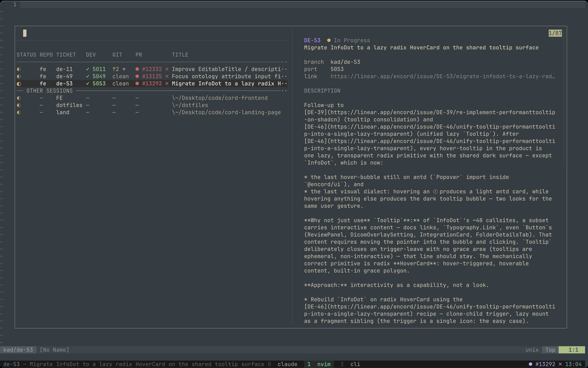

# dotfiles

Personal dotfiles. The centerpiece is **`ticket.sh`** — a Linear-ticket-driven
workflow that pairs a git worktree, a tmux session, and a Claude agent per
ticket, with a floating dashboard for navigating between them.



*The dashboard (`prefix + s`): every worktree with its live agent/dev/git/PR
status on the left, and the highlighted ticket's Linear context on the right.*

---

## Highlights

- **One command per ticket.** Paste a Linear branch name and get a ready-to-work
  environment: an isolated git worktree, a dedicated tmux session, a Claude agent
  already primed with the ticket's context, and a dev server on its own port.
- **True parallel tickets.** Every ticket is its own worktree, branch, and dev
  port, so several can be in-flight at once — no stashing, no branch-switching,
  no port clashes. Jump between them from the dashboard.
- **Linear-aware.** The issue's title and description are fetched up front, saved
  into the worktree for the agent to read, and shown in the status bar and
  dashboard. Backfill older worktrees on demand.
- **Agent-aware.** The dashboard shows, per ticket, whether the Claude agent is
  idle, actively working, or waiting on you — so you can see across every ticket
  which one needs attention without opening it.
- **Status at a glance.** Each row surfaces dev-server up/down, git
  ahead/behind/dirty, and live GitHub PR check status.
- **Instant dashboard.** The popup paints from a cache immediately and refreshes
  in the background, so it opens with no perceptible delay.
- **Create & clean up in place.** Spin up new tickets or general sessions, and
  tear down finished ones, right from the dashboard. Removal is non-blocking and
  always keeps the branch.
- **General sessions too.** Long-running non-ticket sessions (`fe` / `be` / `lp`
  / dotfiles / custom) live alongside tickets under **OTHER SESSIONS**.
- **Survives restarts.** tmux-resurrect + continuum persist and auto-restore your
  sessions across reboots.

---

## `ticket.sh` — one ticket → one worktree → one tmux session

Drop a Linear-style branch name (`kad/de-20-fix-login`) and you get:

- a git worktree at `~/worktrees/<repo>/<slug>` on that branch (forked from
  `TICKET_BASE_BRANCH` if the branch is new)
- a tmux **session** named after the slug, with three windows:
  - **claude** — agent running in the worktree
  - **nvim** — editor in the worktree
  - **cli** — scratch shell (left) + dev server on a per-ticket port
    (top-right) + scratch shell (bottom-right)
- the Linear issue's **title + description** auto-fetched and saved to
  `<worktree>/.ticket-context.md` (so Claude has it in-context)
- the title stashed onto the tmux session so the **status bar** shows it next
  to the session name
- a **PR badge** in the status bar that watches `gh pr view` for the branch

### Quick start

```sh
ticket kad/de-20-fix-login        # uses the repo you're currently in
ticket --fe kad/de-20-fix-login   # forces TICKET_FE_REPO (works from anywhere)
ticket --be kad/de-20-fix-login   # forces TICKET_BE_REPO (works from anywhere)
tickets                           # list active worktrees in current repo
tickets --fe                      # ...or in fe / be
unticket de-20                    # kill the session, remove the worktree (branch kept)
unticket --fe de-20               # works from anywhere
```

---

## Setup

### Dependencies

| Tool   | Why                                            | Install                |
|--------|------------------------------------------------|------------------------|
| tmux   | sessions + popups                              | `brew install tmux`    |
| fzf    | dashboard + picker UI                          | `brew install fzf`     |
| jq     | parsing Linear + gh JSON                       | `brew install jq`      |
| gh     | PR-status badge                                | `brew install gh && gh auth login` |
| pnpm   | auto-`pnpm install` in fresh worktrees         | `brew install pnpm`    |
| nvim   | the editor window                              | `brew install neovim`  |
| claude | the agent window (Anthropic CLI)               | https://claude.com/code |
| curl   | Linear API requests                            | (built in)             |

### Config — set in `~/.zshrc` **before** `source ~/dotfiles/ticket.sh`

```sh
# repo paths so `ticket --fe` / `ticket --be` work from anywhere
export TICKET_FE_REPO="$HOME/Desktop/code/cord-frontend"   # default already correct
export TICKET_BE_REPO="$HOME/Desktop/code/cord-backend"    # default already correct

# optional overrides
export TICKET_WT_ROOT="$HOME/worktrees"                    # where worktrees live
export TICKET_PORT_BASE=5000                               # dev port = base + (issue # mod 1000)
export TICKET_BASE_BRANCH="master"                         # branches forked from this
export TICKET_AGENT_CMD="claude"                           # command for the claude window
export TICKET_EDITOR_CMD="nvim"                            # command for the nvim window
export TICKET_DEV_CMD="pnpm dev --port __PORT__"           # __PORT__ gets substituted
```

### Linear API key — keep it out of the dotfiles repo

The Linear context-fetch needs `LINEAR_API_KEY`. **Do not** put this in
`~/dotfiles/.zshrc` — that file is tracked in git. Put it in `~/.zshenv`
instead (auto-sourced by zsh, lives outside the repo):

```sh
# in ~/.zshenv  (create the file if it doesn't exist)
export LINEAR_API_KEY="lin_api_xxxxxxxx"
```

Get a key from **Linear → Settings → API → Personal API keys**. If
`LINEAR_API_KEY` is unset, ticket creation still works — the Linear fetch is
just silently skipped and the status bar / dashboard show `—` instead of a
title.

### Optional: GitHub PR badge

The status bar shows a PR badge per session if you have `gh` installed and
authenticated:

```sh
gh auth login
```

Without `gh`, the badge stays empty.

---

## The dashboard (`prefix + s`)

A floating popup listing every worktree under `~/worktrees`, plus any other live
tmux sessions. It opens **instantly** — it paints the last-rendered rows from a
cache and refreshes in the background — and it's the main way to move between
tickets.

Each row has these columns:

| Column     | Meaning |
|------------|---------|
| **STATUS** | Session + agent state (see glyphs below) |
| **REPO**   | Short repo label — `fe` / `be` / `lp` / … |
| **TICKET** | Slug (e.g. `de-11`) |
| **DEV**    | Dev server: `✓ <port>` up, `✗ <port>` down, `—` none |
| **GIT**    | `↑n` ahead, `↓n` behind, `*` dirty, or `clean` |
| **PR**     | GitHub PR badge (same glyphs as the status line, below) |
| **TITLE**  | Linear issue title |

The **STATUS** glyph combines whether a tmux session exists with what the Claude
agent is doing (sampled from the `claude` pane):

| Glyph | Meaning |
|-------|---------|
| `○`   | dim — no tmux session (dormant worktree) |
| `●`   | session live · agent idle at the prompt |
| `◐`   | session live · agent working (running a tool / streaming) |
| `⚠`   | session live · agent waiting for you to respond |

The **right pane** previews the highlighted ticket's Linear title, state,
description, recent commits, and working-tree changes.

### Keys

**Navigate** (vim-style — fuzzy search is off until you press `/`):

| Key            | Action |
|----------------|--------|
| `j` / `k`      | Down / up |
| `g` / `G`      | First / last row |
| `Ctrl-D` / `Ctrl-U` | Half-page down / up |
| `/`            | Toggle search mode (typing filters; the action keys type instead of acting) |
| `q` / `Esc` / `Ctrl-C` | Close popup |
| `Enter`        | Switch to the session (creating it if the worktree is dormant) |

**Act** on the highlighted row (plain letters — no modifier):

| Key | Action |
|-----|--------|
| `x` | Remove the worktree + kill its session (prompts to force if the tree is dirty) |
| `o` | Open the Linear issue in your browser |
| `p` | Open the PR in your browser (`gh pr view --web`) |
| `e` | Open the worktree in `$EDITOR` |
| `b` | Copy the branch name to the clipboard |
| `n` | New ticket (prompts for branch + repo) |
| `N` | New general session (`fe` / `be` / `lp` / dotfiles / custom) |
| `f` | Backfill Linear context for this worktree (if missing) |
| `r` | Force-refresh all PR badges |
| `?` | Show the full key reference in the preview pane |

`x` is non-blocking: a worktree's `node_modules` is often 2 GB+, so instead of
deleting inline (which froze the popup for ~10s) it renames the working dir aside
and deletes it in the background. The branch is always kept. Killing the session
you're *currently in* closes the popup and drops you into another session.

## Tmux integration

### Status line

- **left**: `<session-name> — <Linear title>` (title shown when
  `@ticket_title` is set on the session, which `ticket()` does automatically)
- **right**: PR badge for the current session + clock
  - `● #123 ✓` — open, all checks passing
  - `● #123 ✗` — open, a check failing
  - `● #123 …` — open, checks pending
  - `◆ #123`   — merged
  - `○ #123`   — closed (unmerged)
  - blank      — no PR / not a ticket session / `gh` failed

PR data is cached in `~/.cache/ticket/pr-<slug>.txt` for 60s. The status bar
refreshes every 10s but only hits `gh` when the cache is stale.

---

## File layout

```
~/dotfiles/
  ticket.sh                    sourced from .zshrc — defines ticket / tickets / unticket
  .tmux.conf                   binds + status-line wiring
  .zshrc                       sources ticket.sh at the bottom
  bin/
    ticket-dashboard           prefix+s popup (fzf-based); paints from a row cache, refreshes async
    ticket-rm                  `x` handler: remove worktree (non-blocking) + kill session
    ticket-new                 `n` handler: prompt for a branch + repo, then create a ticket
    ticket-new-session         `N` handler: create/attach a general (non-ticket) session
    ticket-claude-state        detect the claude pane's state (idle / working / waiting) for STATUS
    ticket-linear-fetch        GraphQL fetch of one Linear issue
    ticket-backfill            populate ticket.json/.ticket-context.md for an existing worktree
    ticket-open-linear         `o` helper: opens the Linear URL only if one is cached
    ticket-pr-badge            status-line + dashboard PR badge w/ disk cache
    ticket-preview             richer worktree preview renderer
    ticket-preview-row         right-pane renderer for a dashboard row
    ticket-preview-session     right-pane renderer for an OTHER-SESSION row
    ticket-help                full key reference (shown on `?`)

~/worktrees/<repo>/<slug>/     the worktree itself
  .ticket-context.md           Linear title + description (gitignored locally)

<worktree>/.git/worktrees/<slug>/ticket.json
  per-ticket metadata: identifier, title, description, state, url,
  branch, repo, port, created_at

~/.cache/ticket/
  pr-<slug>.txt                cached PR badge per session
  rows.txt                     last-rendered dashboard rows (for instant paint on open)
```

---

## Troubleshooting

**Dashboard shows `—` for titles even after I created a ticket.**
The Linear fetch needs `LINEAR_API_KEY`. The dashboard auto-sources
`~/.zshenv` on startup, so once the key is in that file the next popup will
have it. For existing worktrees, press `f` on a row (or run
`ticket-backfill --all` from a shell) to populate `ticket.json` for all of
them.

**`f` in the dashboard says "no linear context cached" or just flashes.**
The backfill failed — probably because Linear couldn't be reached or your
key is invalid. Run `ticket-backfill <slug>` from a shell to see the actual
error. The dashboard auto-sources `~/.zshenv`, but if the tmux server was
started before you added the key, you can also push it into the running
server with `tmux setenv -g LINEAR_API_KEY "$LINEAR_API_KEY"`.

**`o` does nothing.**
The row has no cached Linear URL (yet). Press `f` first to backfill,
then `o` will open the issue in your browser.

**Two repos with the same ticket id collide.**
Sessions are named purely by slug. If you `ticket --fe kad/de-20` *and*
`ticket --be kad/de-20`, the second call just switches to the first session
because both want to be named `de-20`. Workarounds: only have one active at
a time, or hand-edit `ticket.sh` to use `sess="<repo_label>-$slug"` (will
orphan existing sessions).

**`ticket: base branch 'master' not found locally or on origin`.**
Your `TICKET_BASE_BRANCH` doesn't exist in the repo. Set it (e.g.
`export TICKET_BASE_BRANCH=main`) and re-run.

**Dev server pane shows `command not found`.**
The dev command resolves via `command -v` *at ticket creation time* — make
sure your shell has the right PATH when you call `ticket` (nvm, pnpm, bun
all need to be on PATH).

**PR badge always blank.**
Run `gh auth status` — if not logged in, run `gh auth login`. If you're on
a private repo, make sure the auth has access. The badge script swallows
errors silently so the status bar never breaks.

**I want the dashboard to pick up a new repo.**
The dashboard iterates `~/worktrees/*/*`. Any worktree there shows up.
Repo-label rendering (`fe`/`be`/`lp`/…) is keyed off the parent dir name —
edit `repo_label()` in `bin/ticket-dashboard` to add new short labels.
